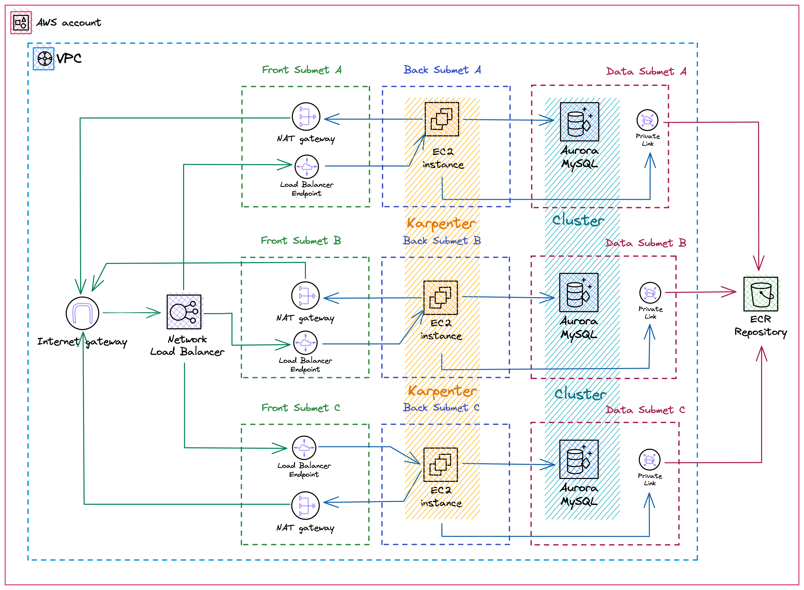

# AWS

This stack creates a network layout with a VPC and three subnets for each
availability zone (9 subnets in total):

* __frontend__: hosts the resoutces with direct access to and from the internet
i.e. loadbalancer and NAT gateway.
* __backend__: hosts resources which ruu workloads, can make request to the
internet (via the NAT gateway) but cannot be accessed from the outside.
* __data__: hosts resources which cannot make request nor be accessed from the
internet, such as databases or private link to access other aws services
internally.

It creates also the EKS Control Plane, all the necessary IAM roles, policies and
security groups, so that the communication can flow between master and workers.
It enables Security Groups for pods, the OIDC provider and IAM roles for service
acounts, which are useful for many scenarios.

About worker nodes, the solution do not use neither managed nodes, nor customer
provided nodes. Instead it leverages the EKS for Fargate profile to run just
the `karpenter` controller.

The latter is the component responsible for detecting other unschedulable pods
and thus creating automatically EC2 instances (preferibly spot) and joining them
to the cluster. In this way there are no autoscaling group to configure and the
karpenter controller can determine the most effective instance size at any time.

As traffic ingress configuration, a network load balancer is offloading TLS
termination and routing requests to the ingress controller running inside the
cluster. TargetGroups are managed automatically via the `aws load balancer
controller` running inside the cluster.

The database uses Aurora Postgresql engine in mutli-az configuration. By default
there is one read replica in addition to the master; but the App Autoscaling can
provision further instances when needed. Backups are automatic and encrypted
with KMS.

Finally this stack create the OCI registries for storing both container images and helm charts, and the TLS certificate via Amazon Certificate Manager.

> Notice that after creating the certificate, you have to manually
> validate it by setting the appropriate records on your DNS zone.

<!-- BEGIN_TF_DOCS -->
## Requirements

| Name | Version |
|------|---------|
|  [terraform](#requirement\_terraform) | ~> 1.3.0 |
|  [aws](#requirement\_aws) | ~> 4.0 |
|  [random](#requirement\_random) | ~> 3.4.0 |
|  [tls](#requirement\_tls) | ~> 4.0.0 |

## Providers

| Name | Version |
|------|---------|
|  [aws](#provider\_aws) | ~> 4.0 |
|  [random](#provider\_random) | ~> 3.4.0 |
|  [tls](#provider\_tls) | ~> 4.0.0 |

## Modules

| Name | Source | Version |
|------|--------|---------|
|  [subnet\_back](#module\_subnet\_back) | ./modules/subnet | n/a |
|  [subnet\_data](#module\_subnet\_data) | ./modules/subnet | n/a |
|  [subnet\_front](#module\_subnet\_front) | ./modules/subnet | n/a |

## Resources

| Name | Type |
|------|------|
| [aws_acm_certificate.cert](https://registry.terraform.io/providers/hashicorp/aws/latest/docs/resources/acm_certificate) | resource |
| [aws_appautoscaling_policy.postgresql](https://registry.terraform.io/providers/hashicorp/aws/latest/docs/resources/appautoscaling_policy) | resource |
| [aws_appautoscaling_target.postgresql](https://registry.terraform.io/providers/hashicorp/aws/latest/docs/resources/appautoscaling_target) | resource |
| [aws_cloudwatch_event_rule.aws_ec2_change](https://registry.terraform.io/providers/hashicorp/aws/latest/docs/resources/cloudwatch_event_rule) | resource |
| [aws_cloudwatch_event_rule.aws_ec2_rebalance](https://registry.terraform.io/providers/hashicorp/aws/latest/docs/resources/cloudwatch_event_rule) | resource |
| [aws_cloudwatch_event_rule.aws_ec2_spot_int](https://registry.terraform.io/providers/hashicorp/aws/latest/docs/resources/cloudwatch_event_rule) | resource |
| [aws_cloudwatch_event_rule.aws_health](https://registry.terraform.io/providers/hashicorp/aws/latest/docs/resources/cloudwatch_event_rule) | resource |
| [aws_cloudwatch_event_target.karpenter_interruption_aws_ec2_change](https://registry.terraform.io/providers/hashicorp/aws/latest/docs/resources/cloudwatch_event_target) | resource |
| [aws_cloudwatch_event_target.karpenter_interruption_aws_ec2_rebalance](https://registry.terraform.io/providers/hashicorp/aws/latest/docs/resources/cloudwatch_event_target) | resource |
| [aws_cloudwatch_event_target.karpenter_interruption_aws_ec2_spot_int](https://registry.terraform.io/providers/hashicorp/aws/latest/docs/resources/cloudwatch_event_target) | resource |
| [aws_cloudwatch_event_target.karpenter_interruption_aws_health](https://registry.terraform.io/providers/hashicorp/aws/latest/docs/resources/cloudwatch_event_target) | resource |
| [aws_cloudwatch_log_group.cluster](https://registry.terraform.io/providers/hashicorp/aws/latest/docs/resources/cloudwatch_log_group) | resource |
| [aws_cloudwatch_log_group.postgresql](https://registry.terraform.io/providers/hashicorp/aws/latest/docs/resources/cloudwatch_log_group) | resource |
| [aws_db_parameter_group.aurora_postgresql_14](https://registry.terraform.io/providers/hashicorp/aws/latest/docs/resources/db_parameter_group) | resource |
| [aws_db_subnet_group.data](https://registry.terraform.io/providers/hashicorp/aws/latest/docs/resources/db_subnet_group) | resource |
| [aws_ecr_repository.golang](https://registry.terraform.io/providers/hashicorp/aws/latest/docs/resources/ecr_repository) | resource |
| [aws_ecr_repository.golang_chart](https://registry.terraform.io/providers/hashicorp/aws/latest/docs/resources/ecr_repository) | resource |
| [aws_ecr_repository.php](https://registry.terraform.io/providers/hashicorp/aws/latest/docs/resources/ecr_repository) | resource |
| [aws_ecr_repository.php_chart](https://registry.terraform.io/providers/hashicorp/aws/latest/docs/resources/ecr_repository) | resource |
| [aws_eip.nat](https://registry.terraform.io/providers/hashicorp/aws/latest/docs/resources/eip) | resource |
| [aws_eks_cluster.control_plane](https://registry.terraform.io/providers/hashicorp/aws/latest/docs/resources/eks_cluster) | resource |
| [aws_eks_fargate_profile.karpenter](https://registry.terraform.io/providers/hashicorp/aws/latest/docs/resources/eks_fargate_profile) | resource |
| [aws_iam_instance_profile.karpenter_node](https://registry.terraform.io/providers/hashicorp/aws/latest/docs/resources/iam_instance_profile) | resource |
| [aws_iam_openid_connect_provider.cluster](https://registry.terraform.io/providers/hashicorp/aws/latest/docs/resources/iam_openid_connect_provider) | resource |
| [aws_iam_policy.aws_lb](https://registry.terraform.io/providers/hashicorp/aws/latest/docs/resources/iam_policy) | resource |
| [aws_iam_policy.cluster_fargate_logging](https://registry.terraform.io/providers/hashicorp/aws/latest/docs/resources/iam_policy) | resource |
| [aws_iam_policy.karpenter_controller_cluster](https://registry.terraform.io/providers/hashicorp/aws/latest/docs/resources/iam_policy) | resource |
| [aws_iam_role.aws_lb](https://registry.terraform.io/providers/hashicorp/aws/latest/docs/resources/iam_role) | resource |
| [aws_iam_role.cluster_fargate](https://registry.terraform.io/providers/hashicorp/aws/latest/docs/resources/iam_role) | resource |
| [aws_iam_role.eks_service](https://registry.terraform.io/providers/hashicorp/aws/latest/docs/resources/iam_role) | resource |
| [aws_iam_role.karpenter_controller](https://registry.terraform.io/providers/hashicorp/aws/latest/docs/resources/iam_role) | resource |
| [aws_iam_role.karpenter_node](https://registry.terraform.io/providers/hashicorp/aws/latest/docs/resources/iam_role) | resource |
| [aws_iam_role.rds_monitoring](https://registry.terraform.io/providers/hashicorp/aws/latest/docs/resources/iam_role) | resource |
| [aws_iam_role_policy_attachment.aws_lb](https://registry.terraform.io/providers/hashicorp/aws/latest/docs/resources/iam_role_policy_attachment) | resource |
| [aws_iam_role_policy_attachment.cluster_fargate](https://registry.terraform.io/providers/hashicorp/aws/latest/docs/resources/iam_role_policy_attachment) | resource |
| [aws_iam_role_policy_attachment.cluster_fargate_logging](https://registry.terraform.io/providers/hashicorp/aws/latest/docs/resources/iam_role_policy_attachment) | resource |
| [aws_iam_role_policy_attachment.eks_cluster_policy](https://registry.terraform.io/providers/hashicorp/aws/latest/docs/resources/iam_role_policy_attachment) | resource |
| [aws_iam_role_policy_attachment.eks_resource_controller](https://registry.terraform.io/providers/hashicorp/aws/latest/docs/resources/iam_role_policy_attachment) | resource |
| [aws_iam_role_policy_attachment.karpenter_controller_cluster](https://registry.terraform.io/providers/hashicorp/aws/latest/docs/resources/iam_role_policy_attachment) | resource |
| [aws_iam_role_policy_attachment.karpenter_node_cni](https://registry.terraform.io/providers/hashicorp/aws/latest/docs/resources/iam_role_policy_attachment) | resource |
| [aws_iam_role_policy_attachment.karpenter_node_ecr](https://registry.terraform.io/providers/hashicorp/aws/latest/docs/resources/iam_role_policy_attachment) | resource |
| [aws_iam_role_policy_attachment.karpenter_node_ssm](https://registry.terraform.io/providers/hashicorp/aws/latest/docs/resources/iam_role_policy_attachment) | resource |
| [aws_iam_role_policy_attachment.karpenter_node_worker](https://registry.terraform.io/providers/hashicorp/aws/latest/docs/resources/iam_role_policy_attachment) | resource |
| [aws_iam_role_policy_attachment.rds_monitoring_enhanced](https://registry.terraform.io/providers/hashicorp/aws/latest/docs/resources/iam_role_policy_attachment) | resource |
| [aws_internet_gateway.main](https://registry.terraform.io/providers/hashicorp/aws/latest/docs/resources/internet_gateway) | resource |
| [aws_nat_gateway.main](https://registry.terraform.io/providers/hashicorp/aws/latest/docs/resources/nat_gateway) | resource |
| [aws_rds_cluster.postgresql](https://registry.terraform.io/providers/hashicorp/aws/latest/docs/resources/rds_cluster) | resource |
| [aws_rds_cluster_instance.postgresql](https://registry.terraform.io/providers/hashicorp/aws/latest/docs/resources/rds_cluster_instance) | resource |
| [aws_rds_cluster_parameter_group.aurora_postgresql_14](https://registry.terraform.io/providers/hashicorp/aws/latest/docs/resources/rds_cluster_parameter_group) | resource |
| [aws_route.back](https://registry.terraform.io/providers/hashicorp/aws/latest/docs/resources/route) | resource |
| [aws_route.front](https://registry.terraform.io/providers/hashicorp/aws/latest/docs/resources/route) | resource |
| [aws_secretsmanager_secret.postgresql](https://registry.terraform.io/providers/hashicorp/aws/latest/docs/resources/secretsmanager_secret) | resource |
| [aws_secretsmanager_secret_version.postgresql](https://registry.terraform.io/providers/hashicorp/aws/latest/docs/resources/secretsmanager_secret_version) | resource |
| [aws_security_group.cluster](https://registry.terraform.io/providers/hashicorp/aws/latest/docs/resources/security_group) | resource |
| [aws_security_group.karpenter_node](https://registry.terraform.io/providers/hashicorp/aws/latest/docs/resources/security_group) | resource |
| [aws_security_group.postgresql](https://registry.terraform.io/providers/hashicorp/aws/latest/docs/resources/security_group) | resource |
| [aws_security_group.private_link](https://registry.terraform.io/providers/hashicorp/aws/latest/docs/resources/security_group) | resource |
| [aws_sqs_queue.karpenter_interruption](https://registry.terraform.io/providers/hashicorp/aws/latest/docs/resources/sqs_queue) | resource |
| [aws_sqs_queue_policy.karpenter_interruption](https://registry.terraform.io/providers/hashicorp/aws/latest/docs/resources/sqs_queue_policy) | resource |
| [aws_vpc.main](https://registry.terraform.io/providers/hashicorp/aws/latest/docs/resources/vpc) | resource |
| [aws_vpc_endpoint.ecr_api](https://registry.terraform.io/providers/hashicorp/aws/latest/docs/resources/vpc_endpoint) | resource |
| [aws_vpc_endpoint.ecr_dkr](https://registry.terraform.io/providers/hashicorp/aws/latest/docs/resources/vpc_endpoint) | resource |
| [aws_vpc_endpoint.s3](https://registry.terraform.io/providers/hashicorp/aws/latest/docs/resources/vpc_endpoint) | resource |
| [aws_vpc_security_group_egress_rule.cluster_out_all](https://registry.terraform.io/providers/hashicorp/aws/latest/docs/resources/vpc_security_group_egress_rule) | resource |
| [aws_vpc_security_group_egress_rule.control_plane_out_ext](https://registry.terraform.io/providers/hashicorp/aws/latest/docs/resources/vpc_security_group_egress_rule) | resource |
| [aws_vpc_security_group_egress_rule.control_plane_out_node](https://registry.terraform.io/providers/hashicorp/aws/latest/docs/resources/vpc_security_group_egress_rule) | resource |
| [aws_vpc_security_group_egress_rule.karpenter_node_out_all](https://registry.terraform.io/providers/hashicorp/aws/latest/docs/resources/vpc_security_group_egress_rule) | resource |
| [aws_vpc_security_group_ingress_rule.cluster_in_self](https://registry.terraform.io/providers/hashicorp/aws/latest/docs/resources/vpc_security_group_ingress_rule) | resource |
| [aws_vpc_security_group_ingress_rule.control_plane_in_pod](https://registry.terraform.io/providers/hashicorp/aws/latest/docs/resources/vpc_security_group_ingress_rule) | resource |
| [aws_vpc_security_group_ingress_rule.karpenter_node_in_cp](https://registry.terraform.io/providers/hashicorp/aws/latest/docs/resources/vpc_security_group_ingress_rule) | resource |
| [aws_vpc_security_group_ingress_rule.karpenter_node_in_ext](https://registry.terraform.io/providers/hashicorp/aws/latest/docs/resources/vpc_security_group_ingress_rule) | resource |
| [aws_vpc_security_group_ingress_rule.karpenter_node_in_self](https://registry.terraform.io/providers/hashicorp/aws/latest/docs/resources/vpc_security_group_ingress_rule) | resource |
| [aws_vpc_security_group_ingress_rule.postgresql_in_backend](https://registry.terraform.io/providers/hashicorp/aws/latest/docs/resources/vpc_security_group_ingress_rule) | resource |
| [aws_vpc_security_group_ingress_rule.private_link_in_back](https://registry.terraform.io/providers/hashicorp/aws/latest/docs/resources/vpc_security_group_ingress_rule) | resource |
| [aws_vpc_security_group_ingress_rule.private_link_in_data](https://registry.terraform.io/providers/hashicorp/aws/latest/docs/resources/vpc_security_group_ingress_rule) | resource |
| [random_password.postgresql](https://registry.terraform.io/providers/hashicorp/random/latest/docs/resources/password) | resource |
| [aws_availability_zones.available](https://registry.terraform.io/providers/hashicorp/aws/latest/docs/data-sources/availability_zones) | data source |
| [aws_caller_identity.current](https://registry.terraform.io/providers/hashicorp/aws/latest/docs/data-sources/caller_identity) | data source |
| [aws_default_tags.current](https://registry.terraform.io/providers/hashicorp/aws/latest/docs/data-sources/default_tags) | data source |
| [aws_iam_policy_document.aws_lb](https://registry.terraform.io/providers/hashicorp/aws/latest/docs/data-sources/iam_policy_document) | data source |
| [aws_iam_policy_document.aws_lb_assume](https://registry.terraform.io/providers/hashicorp/aws/latest/docs/data-sources/iam_policy_document) | data source |
| [aws_iam_policy_document.cluster_fargate_assume](https://registry.terraform.io/providers/hashicorp/aws/latest/docs/data-sources/iam_policy_document) | data source |
| [aws_iam_policy_document.cluster_fargate_logging](https://registry.terraform.io/providers/hashicorp/aws/latest/docs/data-sources/iam_policy_document) | data source |
| [aws_iam_policy_document.eks_svc_assume_role](https://registry.terraform.io/providers/hashicorp/aws/latest/docs/data-sources/iam_policy_document) | data source |
| [aws_iam_policy_document.karpenter_controller_assume](https://registry.terraform.io/providers/hashicorp/aws/latest/docs/data-sources/iam_policy_document) | data source |
| [aws_iam_policy_document.karpenter_controller_cluster](https://registry.terraform.io/providers/hashicorp/aws/latest/docs/data-sources/iam_policy_document) | data source |
| [aws_iam_policy_document.karpenter_interruption](https://registry.terraform.io/providers/hashicorp/aws/latest/docs/data-sources/iam_policy_document) | data source |
| [aws_iam_policy_document.karpenter_node_assume](https://registry.terraform.io/providers/hashicorp/aws/latest/docs/data-sources/iam_policy_document) | data source |
| [aws_iam_policy_document.private_link_ecr](https://registry.terraform.io/providers/hashicorp/aws/latest/docs/data-sources/iam_policy_document) | data source |
| [aws_iam_policy_document.private_link_ecr_s3](https://registry.terraform.io/providers/hashicorp/aws/latest/docs/data-sources/iam_policy_document) | data source |
| [aws_iam_policy_document.rds_monitoring_assume](https://registry.terraform.io/providers/hashicorp/aws/latest/docs/data-sources/iam_policy_document) | data source |
| [aws_kms_key.rds](https://registry.terraform.io/providers/hashicorp/aws/latest/docs/data-sources/kms_key) | data source |
| [aws_partition.current](https://registry.terraform.io/providers/hashicorp/aws/latest/docs/data-sources/partition) | data source |
| [tls_certificate.cluster](https://registry.terraform.io/providers/hashicorp/tls/latest/docs/data-sources/certificate) | data source |

## Inputs

| Name | Description | Type | Default | Required |
|------|-------------|------|---------|:--------:|
|  [aws\_region](#input\_aws\_region) | AWS region to create resources. Default Stockholm | `string` | `"eu-north-1"` | no |
|  [certificate\_domain](#input\_certificate\_domain) | The domain for which to emit the certificate | `string` | n/a | yes |
|  [cidrs](#input\_cidrs) | The networking CIDRs | `map(string)` | n/a | yes |
|  [control\_plane](#input\_control\_plane) | The control plane configuration | <pre>object({     version = string     public_access = object({       enabled = bool       cidrs   = list(string)     })     log = object({       retention = number       types     = list(string)     })   })</pre> | <pre>{   "log": {     "retention": 7,     "types": [       "api",       "audit",       "authenticator",       "controllerManager",       "scheduler"     ]   },   "public_access": {     "cidrs": [],     "enabled": false   },   "version": "1.25" }</pre> | no |
|  [database](#input\_database) | The configuration for postgresql database | <pre>object({     instance_class          = string     backup_retention_period = number     backup_window           = string     maintenance_window      = string     log = object({       retention = number       exports   = list(string)     })     autoscaling = object({       metric_type        = string       min_capacity       = number       max_capacity       = number       scale_in_cooldown  = number       scale_out_cooldown = number       target_cpu         = number       target_connections = number     })   })</pre> | <pre>{   "autoscaling": {     "max_capacity": 10,     "metric_type": "RDSReaderAverageCPUUtilization",     "min_capacity": 1,     "scale_in_cooldown": 300,     "scale_out_cooldown": 300,     "target_connections": 700,     "target_cpu": 70   },   "backup_retention_period": 7,   "backup_window": "04:00-06:00",   "instance_class": "db.r6g.large",   "log": {     "exports": [       "postgresql"     ],     "retention": 7   },   "maintenance_window": "Mon:00:00-Mon:03:00" }</pre> | no |
|  [environment](#input\_environment) | The environment | `string` | `"test"` | no |
|  [subnets](#input\_subnets) | The networking subnets with respect to VPC | <pre>map(object({     newbits      = number     displacement = number   }))</pre> | n/a | yes |
|  [tags](#input\_tags) | The property to which tagging the resources | `map(string)` | <pre>{   "CreatedBy": "Terraform" }</pre> | no |

## Outputs

| Name | Description |
|------|-------------|
|  [aws\_lb\_name](#output\_aws\_lb\_name) | n/a |
|  [cluster\_fargate](#output\_cluster\_fargate) | n/a |
|  [cluster\_name](#output\_cluster\_name) | n/a |
|  [karpenter\_controller\_name](#output\_karpenter\_controller\_name) | n/a |
|  [karpenter\_interruption\_name](#output\_karpenter\_interruption\_name) | n/a |
|  [karpenter\_node\_profile\_name](#output\_karpenter\_node\_profile\_name) | n/a |
|  [karpenter\_node\_role\_name](#output\_karpenter\_node\_role\_name) | n/a |
|  [networking\_vpc\_id](#output\_networking\_vpc\_id) | n/a |
<!-- END_TF_DOCS -->
